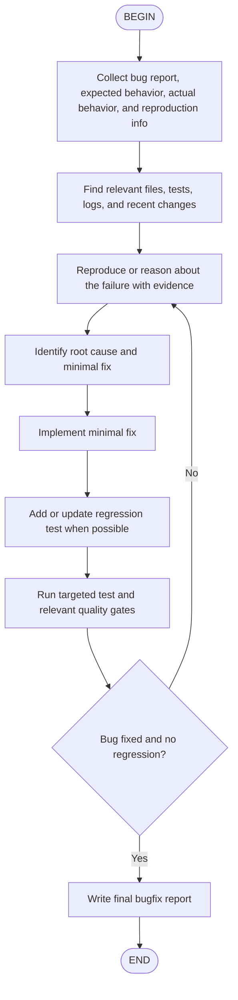

```mermaid
flowchart TD
BEGIN([BEGIN]) --> A[Collect bug report, expected behavior, actual behavior, and reproduction info]
A --> B[Find relevant files, tests, logs, and recent changes]
B --> C[Reproduce or reason about the failure with evidence]
C --> D[Identify root cause and minimal fix]
D --> E[Implement minimal fix]
E --> F[Add or update regression test when possible]
F --> G[Run targeted test and relevant quality gates]
G --> H{Bug fixed and no regression?}
H -->|No| C
H -->|Yes| I[Write final bugfix report]
I --> END([END])
```
