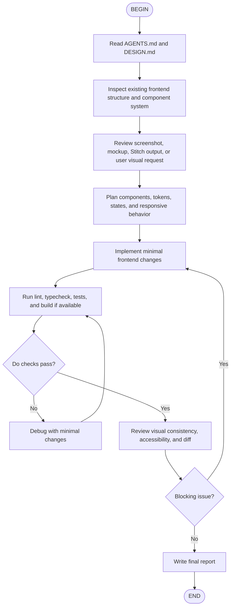

```mermaid
flowchart TD
BEGIN([BEGIN]) --> A[Read AGENTS.md and DESIGN.md]
A --> B[Inspect existing frontend structure and component system]
B --> C[Review screenshot, mockup, Stitch output, or user visual request]
C --> D[Plan components, tokens, states, and responsive behavior]
D --> E[Implement minimal frontend changes]
E --> F[Run lint, typecheck, tests, and build if available]
F --> G{Do checks pass?}
G -->|No| H[Debug with minimal changes]
H --> F
G -->|Yes| I[Review visual consistency, accessibility, and diff]
I --> J{Blocking issue?}
J -->|Yes| E
J -->|No| K[Write final report]
K --> END([END])
```
