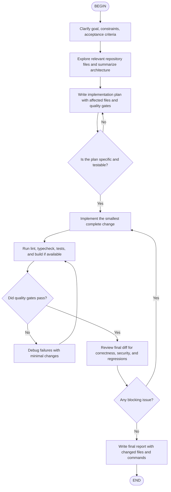

```mermaid
flowchart TD
BEGIN([BEGIN]) --> A[Clarify goal, constraints, acceptance criteria]
A --> B[Explore relevant repository files and summarize architecture]
B --> C[Write implementation plan with affected files and quality gates]
C --> D{Is the plan specific and testable?}
D -->|No| C
D -->|Yes| E[Implement the smallest complete change]
E --> F[Run lint, typecheck, tests, and build if available]
F --> G{Did quality gates pass?}
G -->|No| H[Debug failures with minimal changes]
H --> F
G -->|Yes| I[Review final diff for correctness, security, and regressions]
I --> J{Any blocking issue?}
J -->|Yes| E
J -->|No| K[Write final report with changed files and commands]
K --> END([END])
```
