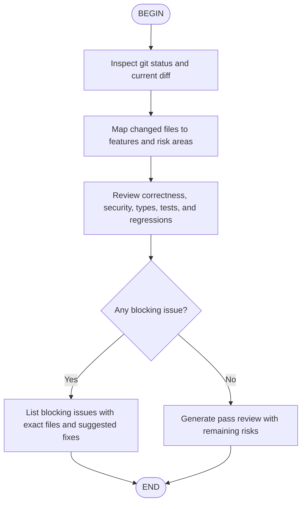

```mermaid
flowchart TD
BEGIN([BEGIN]) --> A[Inspect git status and current diff]
A --> B[Map changed files to features and risk areas]
B --> C[Review correctness, security, types, tests, and regressions]
C --> D{Any blocking issue?}
D -->|Yes| E[List blocking issues with exact files and suggested fixes]
D -->|No| F[Generate pass review with remaining risks]
E --> END([END])
F --> END([END])
```
