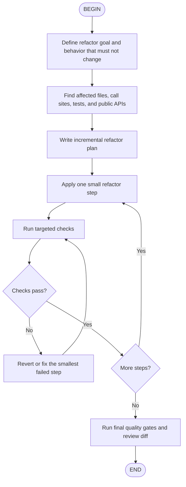

```mermaid
flowchart TD
BEGIN([BEGIN]) --> A[Define refactor goal and behavior that must not change]
A --> B[Find affected files, call sites, tests, and public APIs]
B --> C[Write incremental refactor plan]
C --> D[Apply one small refactor step]
D --> E[Run targeted checks]
E --> F{Checks pass?}
F -->|No| G[Revert or fix the smallest failed step]
G --> E
F -->|Yes| H{More steps?}
H -->|Yes| D
H -->|No| I[Run final quality gates and review diff]
I --> END([END])
```
