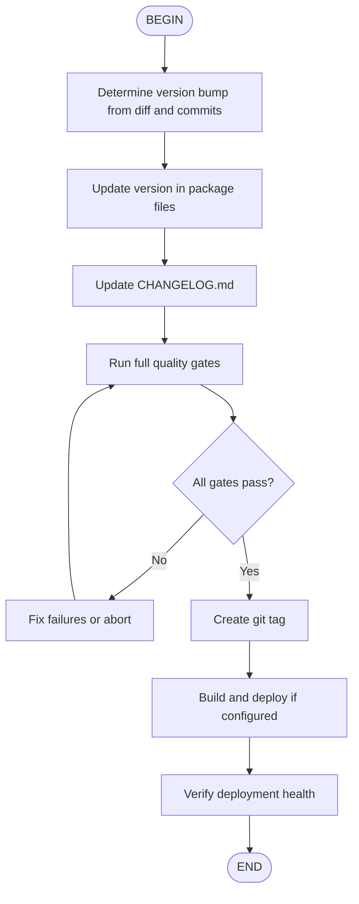

```mermaid
flowchart TD
BEGIN([BEGIN]) --> A[Determine version bump from diff and commits]
A --> B[Update version in package files]
B --> C[Update CHANGELOG.md]
C --> D[Run full quality gates]
D --> E{All gates pass?}
E -->|No| F[Fix failures or abort]
F --> D
E -->|Yes| G[Create git tag]
G --> H[Build and deploy if configured]
H --> I[Verify deployment health]
I --> END([END])
```
