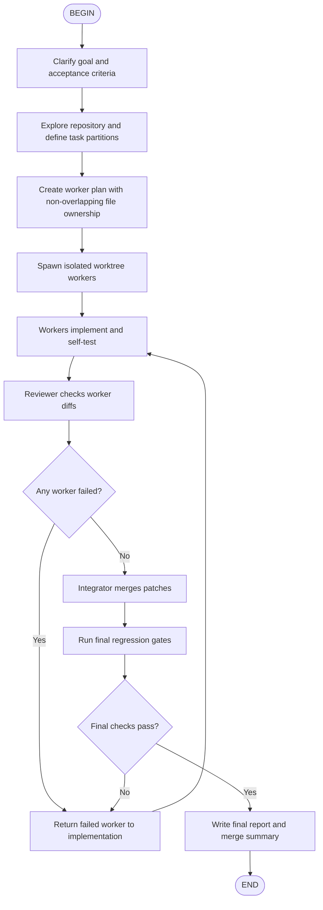

```mermaid
flowchart TD
BEGIN([BEGIN]) --> A[Clarify goal and acceptance criteria]
A --> B[Explore repository and define task partitions]
B --> C[Create worker plan with non-overlapping file ownership]
C --> D[Spawn isolated worktree workers]
D --> E[Workers implement and self-test]
E --> F[Reviewer checks worker diffs]
F --> G{Any worker failed?}
G -->|Yes| H[Return failed worker to implementation]
H --> E
G -->|No| I[Integrator merges patches]
I --> J[Run final regression gates]
J --> K{Final checks pass?}
K -->|No| H
K -->|Yes| L[Write final report and merge summary]
L --> END([END])
```
